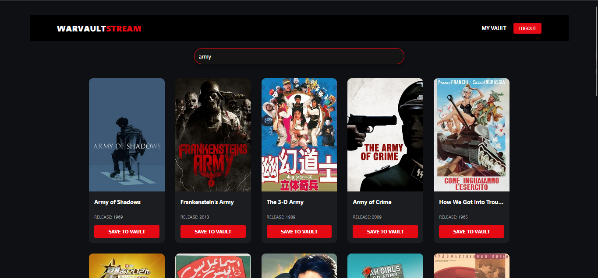
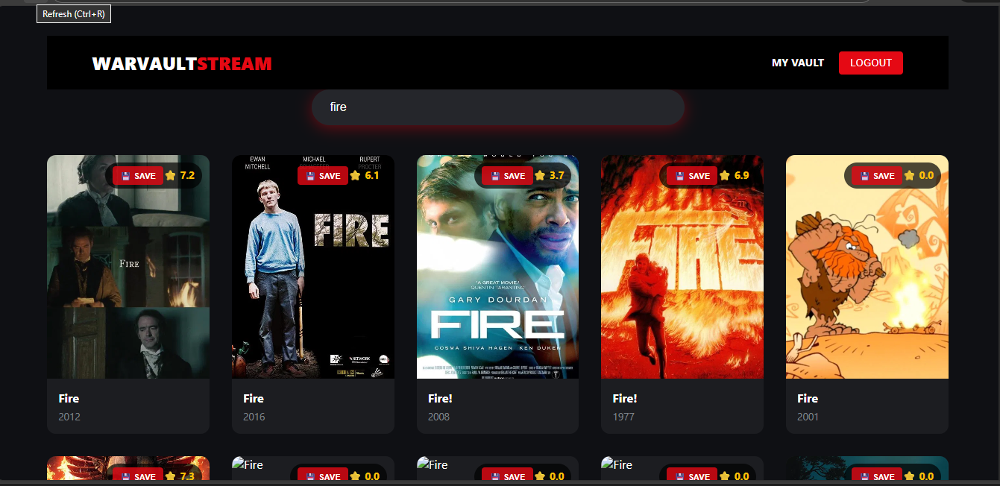
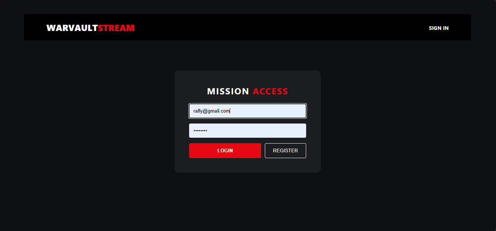
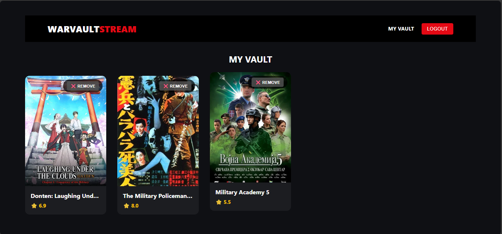
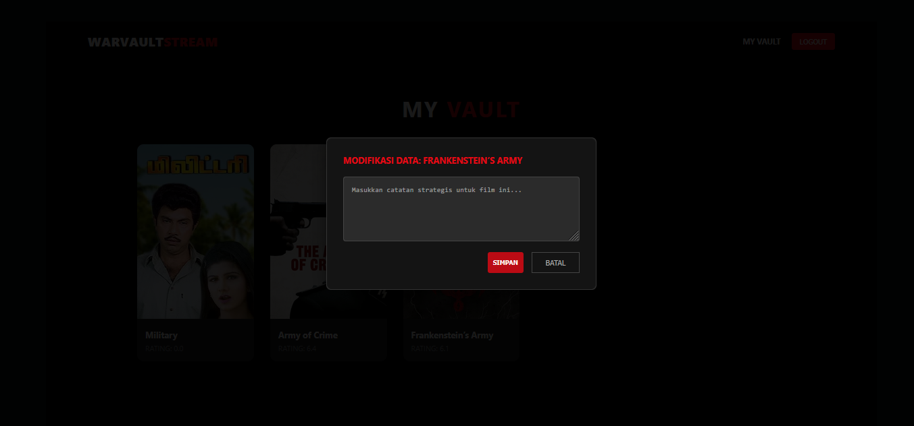

# Laporan Proyek UAS: WarVault Stream Portal

Dokumen ini disusun sebagai laporan teknis untuk memenuhi syarat penilaian mata kuliah **Praktikum Pemrograman Berbasis Web**.

### Identitas Mahasiswa

* **Nama**: Rafly Fahlevi Herdiana
* **NIM**: 2307018
* **Program Studi**: Sistem Informasi
* **Institusi**: Institut Teknologi Garut (ITG)
* **Dosen Pengampu**: Sigit Hudawiguna, S.Kom., M.Kom.


### Deskripsi Proyek
**WarVault** adalah aplikasi portal film bertema militer yang memungkinkan pengguna untuk melakukan eksplorasi database film secara real-time. Proyek ini mengintegrasikan layanan Cloud Computing untuk autentikasi dan penyimpanan data guna memberikan pengalaman pengguna yang aman dan responsif.

### Teknologi yang Digunakan (Tech Stack)
* **Frontend**: React.js dengan Vite sebagai build tool untuk performa antarmuka yang optimal.
* **Database**: Firebase Cloud Firestore sebagai media penyimpanan NoSQL berbasis cloud.
* **Autentikasi**: Firebase Auth untuk manajemen akun pengguna secara aman.
* **Sumber Data**: TMDB API untuk akses database film global secara real-time.
* **Deployment**: Firebase Hosting untuk publikasi aplikasi online.

### Fitur Utama (Implementasi CRUD & Auth)
Aplikasi ini mengimplementasikan fitur:
1. **Autentikasi & Isolasi Data**: Mendukung Register dan Login. Data koleksi bersifat pribadi dan tidak dapat diakses oleh pengguna lain (Data Isolation). 
2. **Create (Save to Vault)**: Menambahkan film dari hasil pencarian API ke dalam database koleksi pribadi (Firestore).
3. **Read (Local Storage)**: Menampilkan daftar film yang telah disimpan oleh pengguna ke dalam halaman "The Vault".
4. **Update (Edit Notes)**: Pengguna dapat menambahkan atau mengubah catatan pribadi/review pada film yang telah disimpan di database. 
5. **Delete (Remove from Vault)**: Menghapus film dari koleksi pribadi secara permanen.


### Panduan Instalasi (Installation Guide)

Untuk menjalankan proyek ini di lingkungan pengembangan lokal, silakan ikuti langkah-langkah berikut:

1. **Clone Repository**:
   ```powershell
   git clone [https://github.com/fahlevirafly29/UAS-PBW-2307018-WarVault.git](https://github.com/fahlevirafly29/UAS-PBW-2307018-WarVault.git)
Instalasi Dependensi: Pastikan Anda berada di dalam folder proyek, lalu jalankan perintah:

PowerShell
npm install
Menjalankan Server Lokal: Gunakan perintah berikut untuk memulai aplikasi di laptop Anda:

PowerShell
npm run dev
Aplikasi akan berjalan secara default pada alamat: http://localhost:5173.

## 📸 Dokumentasi (Screenshots)

Berikut adalah tampilan antarmuka aplikasi **WARVAULT**:

### 1. Halaman Utama (Katalog Film)


### 2. Sistem Akses (Login & Register)
| Login Page | Register Page |
|------------|---------------|
|  |  |

### 3. Koleksi Pribadi (My Vault)


### 4. Fitur Update (Edit Note)


Tautan
Live Application (Firebase): https://warvault-uas.web.app

Repository GitHub: UAS-PBW-2307018-WarVault